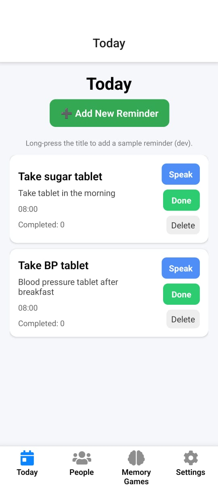
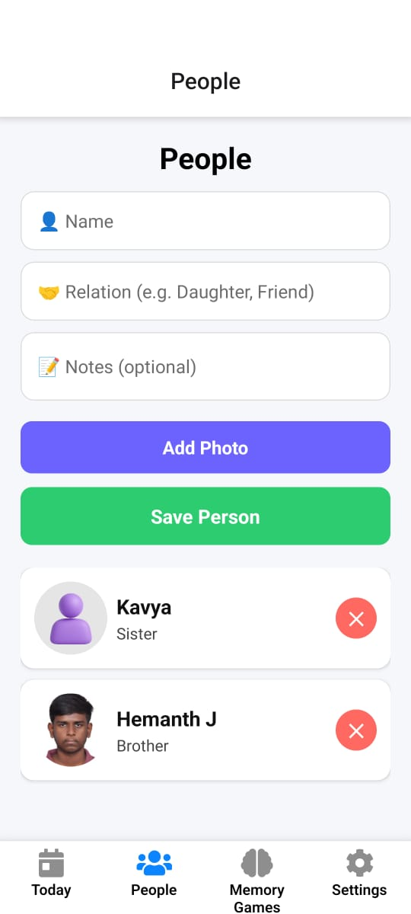
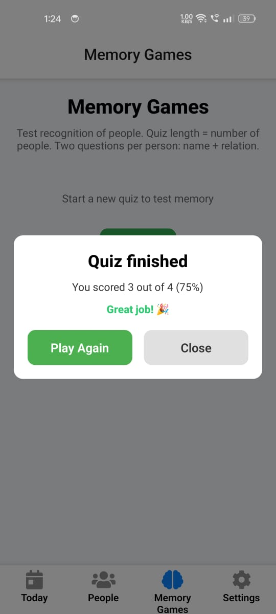

---

# RemindMe+ — Alzheimer’s Memory Helper App

**RemindMe+** is an offline-first mobile application built with **React Native (Expo)** to support individuals with **Alzheimer’s disease and memory-related conditions**.
The app focuses on **daily reminders, people recognition, and cognitive assistance**, while maintaining **simplicity, accessibility, and complete data privacy**.

All user data is stored **locally on the device**. No cloud services, no analytics, and no tracking are used.

---

## Core Goals

* Help users remember daily tasks and medications
* Assist in recognizing family members, friends, and caregivers
* Encourage cognitive engagement through simple interactions
* Ensure privacy-first, offline usage
* Provide a calm and accessible user experience

---

## Tech Stack

| Category       | Technology                               |
| -------------- | ---------------------------------------- |
| Framework      | React Native + Expo                      |
| Language       | TypeScript                               |
| Navigation     | Expo Router                              |
| Local Database | Expo SQLite                              |
| Notifications  | Expo Notifications (local notifications) |
| Voice Output   | Expo Speech (Text-to-Speech)             |
| Media Handling | Expo Image Picker                        |
| Build System   | EAS Build (APK / AAB)                    |
| UI             | Custom React Native components           |

---

## App Features

### Today (Reminders)

* Displays all active reminders for the current day
* Add reminders with title, description, and time
* Supports daily repeating reminders
* Mark reminders as completed
* Optional voice read-out for accessibility
* Time displayed in 12-hour format

---

### People

* Store details of important people
* Includes name, relationship, and photo
* Full-screen photo viewing
* Used by memory games for recognition exercises
* Fully offline and private

---

### Memory Games

* Simple recognition-based cognitive exercises
* Uses saved people data
* Questions such as:

  * Who is this person?
  * What is their relationship?
* Score display and feedback
* Designed to be non-stressful and encouraging

---

### Settings

* Enable or disable local notifications
* Enable or disable voice reminders
* Clear reminders or people data
* Reset all app data
* Designed for both users and caregivers

---

## Notifications

* Uses local notifications only
* Works on Android (including Android 13+) and iOS
* Android notification channels configured correctly
* Notifications continue even when:

  * The app is closed
  * The phone is locked

---

## Accessibility and Design Principles

* Large touch targets
* High-contrast, calm color palette
* Minimal visual clutter
* Optional text-to-speech support
* Designed for elderly users and caregivers

---

## Installation and Setup

Tested with Node 18.x, Expo SDK, and physical Android devices.

### 1. Clone the Repository

```bash
git clone https://github.com/hemanth708c/remindme-plus.git
cd remindme-plus
```

### 2. Install Dependencies

```bash
npm install
```

or

```bash
yarn
```

### 3. Install Expo CLI (if required)

```bash
npm install -g expo-cli
```

### 4. Run in Development

```bash
expo start
```

* Scan the QR code using Expo Go
* Notifications should be tested on a physical device

---

## Build APK (Android)

This project uses EAS Build.

```bash
npx expo prebuild
eas build -p android --profile preview
```

Download and install the generated APK on a real device for notification testing.

---

## Project Structure

```
app/
 ├─ (tabs)/
 │   ├─ today.tsx
 │   ├─ people.tsx
 │   ├─ memory-tests.tsx
 │   └─ settings.tsx
 ├─ add-reminder.tsx
 └─ _layout.tsx

lib/
 └─ notifications.ts

db/
 ├─ index.ts
 └─ repo/
     ├─ reminders.ts
     └─ people.ts

assets/
 ├─ images/
 └─ icons/

app.json
package.json
```

---

## Privacy Policy

* All data is stored locally on the device
* No analytics or tracking
* No cloud sync by default
* Future backup features will be opt-in and encrypted

---

## Testing Notes

* Always test notifications on a physical device
* Disable battery optimizations for reliable reminders
* Emulators are unreliable for notification testing

---

## Roadmap

* Encrypted local backup and restore
* Caregiver assistance mode
* Enhanced memory games and progress tracking
* Dark mode
* Multi-language support
* iOS TestFlight build

---

## Contributing

Contributions and suggestions are welcome.

1. Fork the repository
2. Create a feature branch
3. Commit your changes
4. Push to GitHub
5. Open a pull request with a clear description

---

## Screenshots

<p align="center">
  
  
  
</p>

---

## Author

Created and maintained by **Hemanth J.**
Issues and feedback can be submitted on the GitHub repository.

---

## Final Note

RemindMe+ is designed to gently support memory, independence, and dignity for individuals and caregivers managing memory-related challenges.

Small reminders can make a big difference.

---

